# MLOps

This project aims to implement a complete MLOps solution to predict forest cover type using geospatial data. Tools such as Airflow, MLflow, FastAPI, MinIO, MySQL, and Jupyter notebooks are integrated, all deployed in separate Docker containers as microservices. As shown in the following diagram:

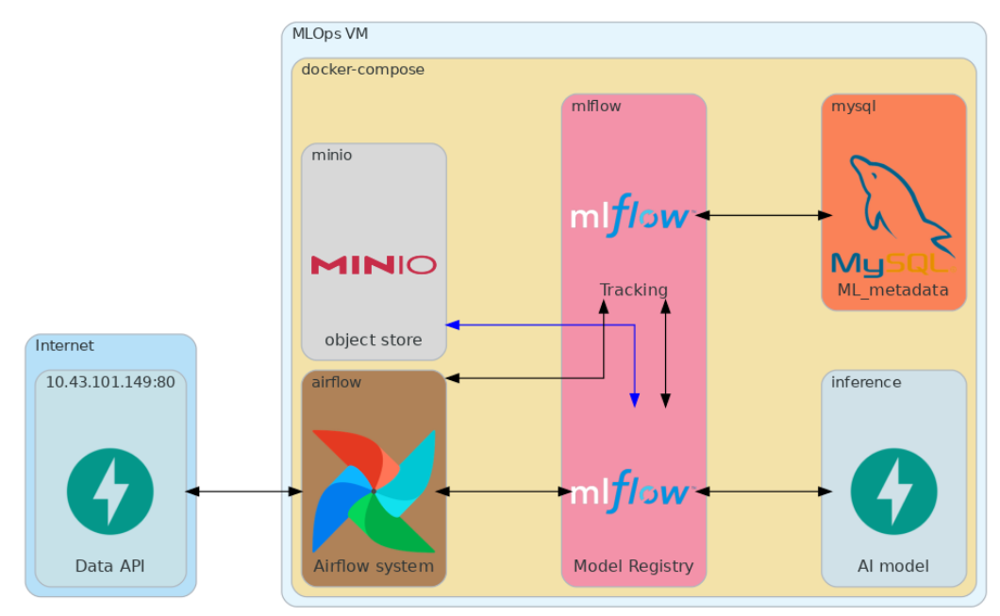

Dataset: CoverType from UCI (simplified version).

## Project Structure

```
Proyecto2/
│── docker-compose.yaml        # Docker Compose file
│── Readme.md                  # Project documentation
│── Airflow/                   
│──── dags/
|────── dag-proyecto2.py                
│──── logs/                    # Folder where logs generated by Airflow DAGs are saved
│──── plugins/                 # Airflow plugins folder
│──── requirements.txt         # Dependencies required for Airflow
│──── Dockerfile               # Dockerfile to build the Airflow container
│── mlflow/                    # Folder with files for the MLflow service
│──── Dockerfile               # Dockerfile to build the MLflow container
│──── requirements.txt         # Dependencies required for the mlflow service
│──── script.sh                # Commands to launch the MLflow service
│── api-data/                  # Folder cloned from the professor to connect to the API that generates raw files
│── api-inference/             # Folder with files to generate the inference API
│──── api.py                   # Python code to generate the inference API using MLflow production models
│──── requirements.txt         # Required dependencies
│──── Dockerfile               # Dockerfile to build the inference API container using FastAPI
│── minio/                     # Volume where the S3 bucket will be located to store MLflow artifacts
```

# Technologies Used

- Python 3.9
- FastAPI
- Scikit-Learn
- Joblib
- Pandas & NumPy
- Docker
- UV
- MySQL
- Airflow
- MLflow
- Minio

---

# Instructions

## 1. Clone the Repository

```
git clone https://github.com/felaponte/MLOps2.git
cd MLOps2
cd Proyecto2
```

## 2. Declare Environment Variables for Airflow

Run in terminal:

```
echo -e "AIRFLOW_UID=$(id -u)" > .env
echo -e "AIRFLOW_PROJ_DIR=./Airflow" >> .env
```

## 3. Build and Launch Services

```
docker compose up --build
```

This will deploy the following services:

- Airflow (port: 8080)
- MLflow (port: 5000)
- MinIO (port: 9001)
- FastAPI for inference (port: 8989)

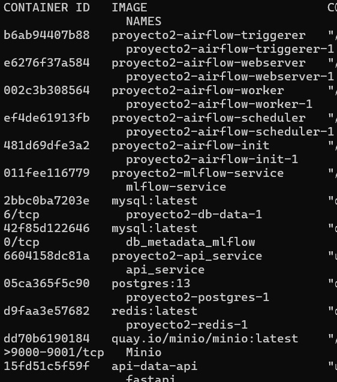

## 4. Log In and Create a Bucket in MinIO:

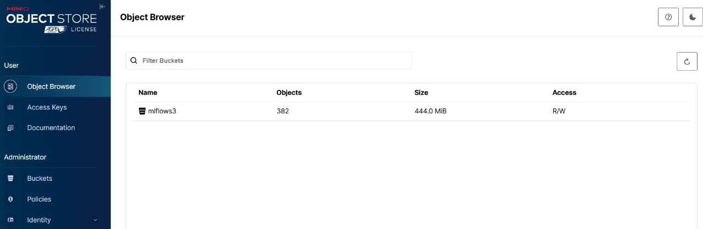

A bucket named `mlflows3` was created.

## 5. Run the DAG from the Airflow UI

We chose to store the data in a MySQL relational database.

As the first task in the DAG, we ensure the database is empty, as shown below:

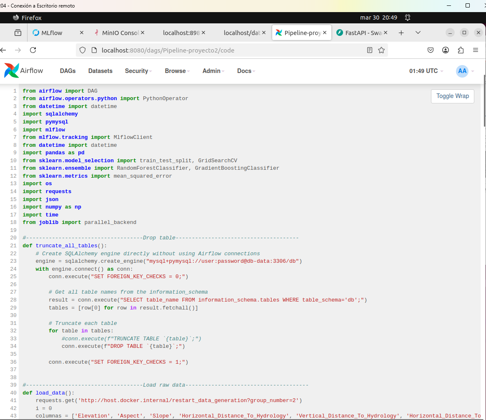

The second task is data ingestion, where we connect to the API where the data is available. By default, each data batch from the API was updated every 5 minutes, but we changed it to 5 seconds for faster processing. This second task connects to the API every 3 seconds to attempt to fetch a new data batch. After retrieving 10 batches, we ingest the raw data into our MySQL database.

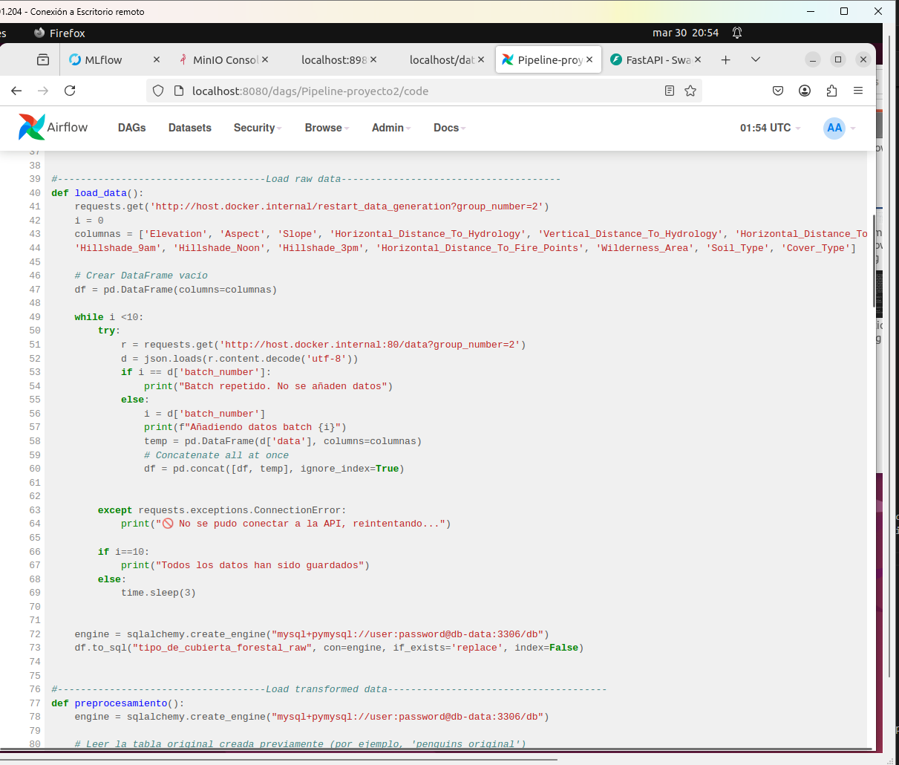

The third task involves preprocessing the data and generating the training and test sets.

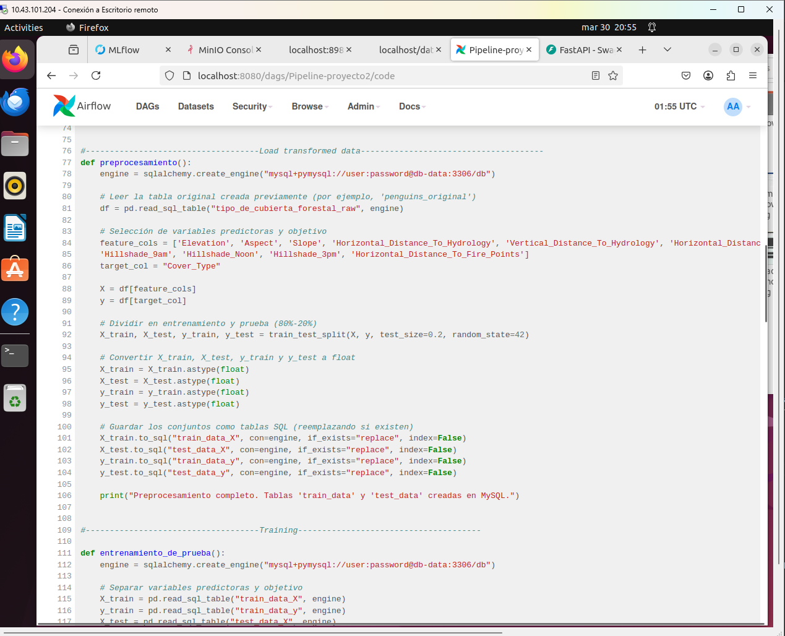

The fourth, fifth, and sixth tasks are where model training takes place, and metrics are registered in MLflow.

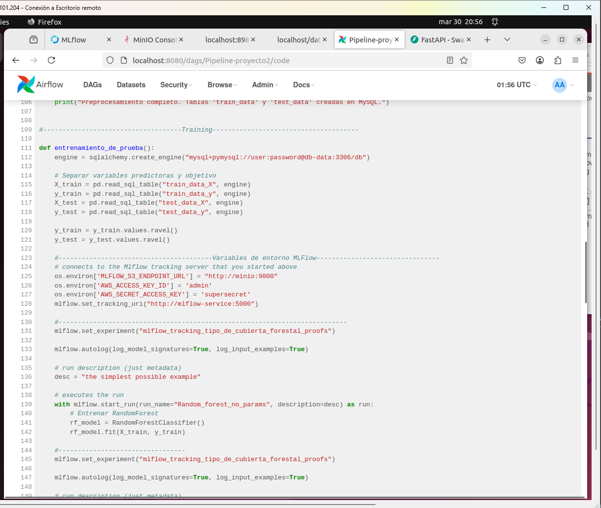

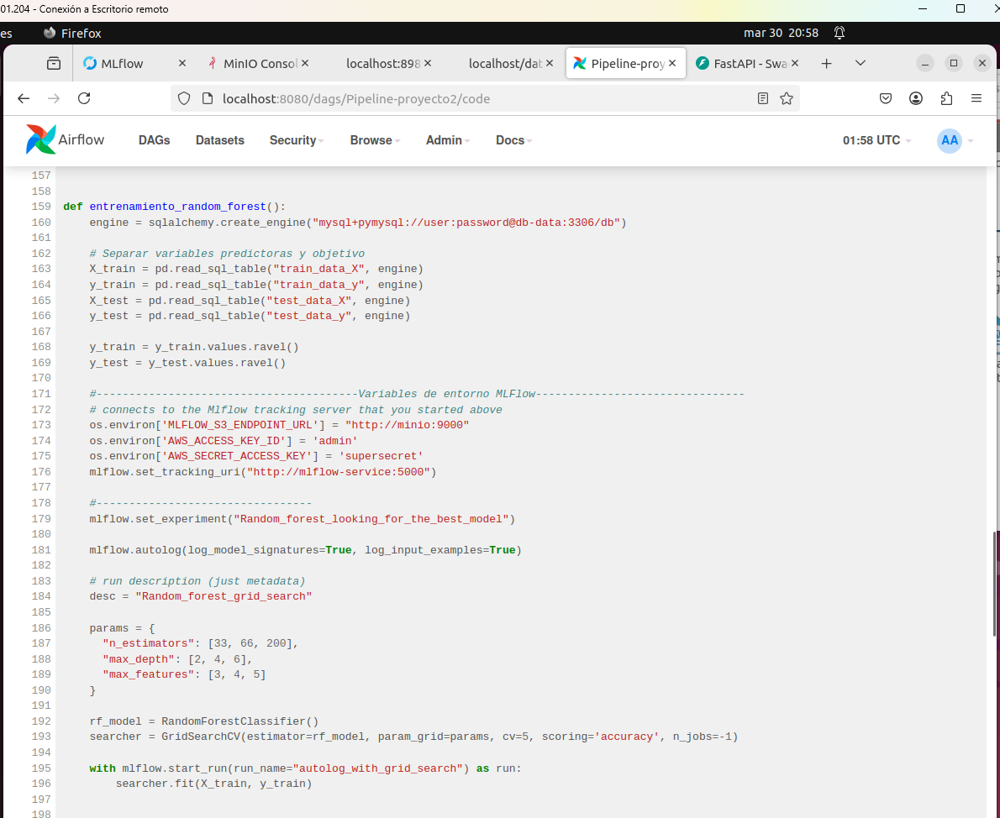

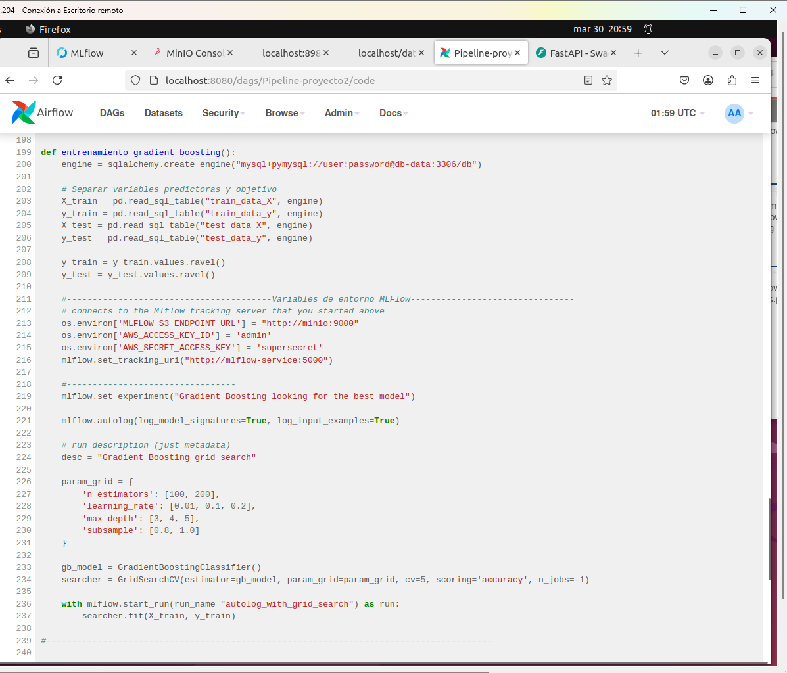

Finally, we run the DAG and wait for execution to complete (the `train_gradient_boosting` task took three hours to finish).

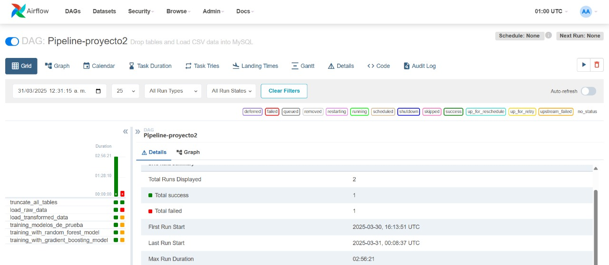

## 6. Review Experiments and Register Models in MLflow

We review the models and experiments executed by the DAG in Airflow.

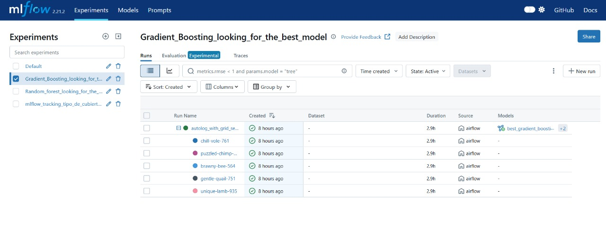

The best models for Random Forest and Gradient Boosting are registered. They must be tagged as "production" so that the API can load them.

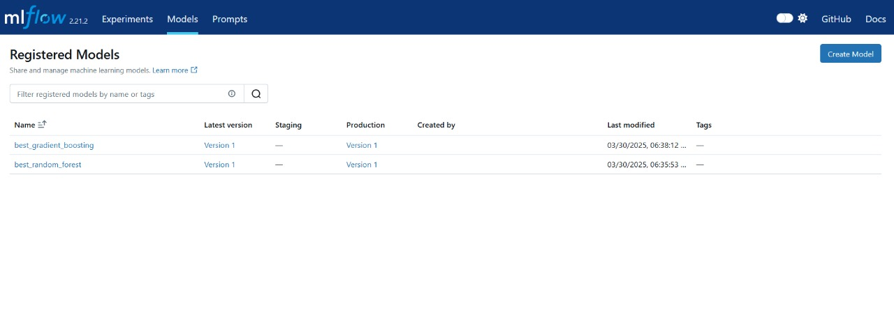

## 7. Running the API Service

The API displays the models we set to production using MLflow.

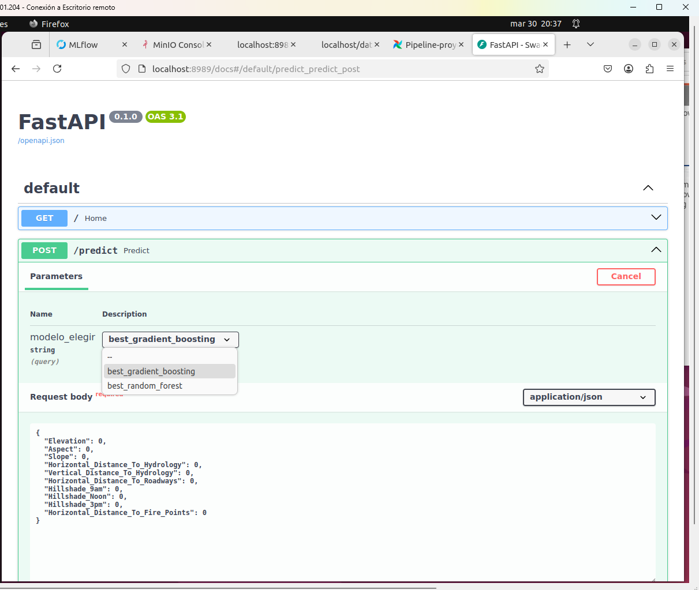

Then, we verify that the production models perform inference correctly.

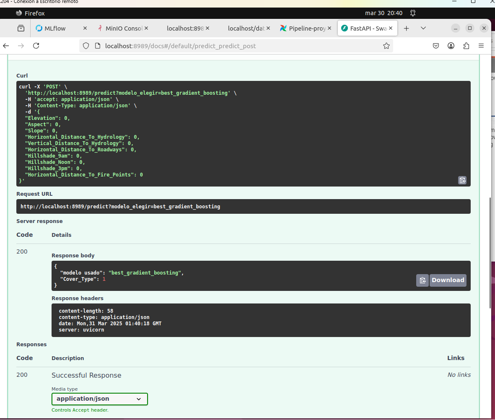
