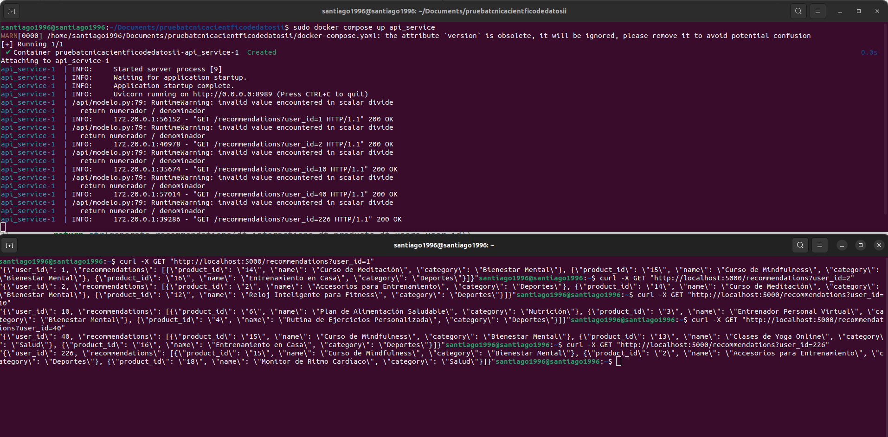

=======
# Sistema de recomendación - prueba técnica
Este proyecto implementa un sistema de recomendación usando FastAPI para el despliegue y Docker para contenerizar la aplicación. Se utilizó UV para hacer la gestión de dependencias.

---
## Explicación del dataset y procesamiento de datos
El dataset se compone de 3 archivos de texto plano en formato CSV con la información de los usuarios, los productos, y las interacciones entre los usuarios con los productos.

El dataset de usuarios (users.csv) contiene los siguientes campos:
**user_id:** Identificador único del usuario.                           **edad:** Edad del usuario                                        **genero:** Género del usuario.	
**nivel_ingresos:** Nivel de ingresos.                                  **nivel_educativo:** Nivel educativo.                             **intereses:** Lista de intereses separados por comas.
**tipo_suscripcion:** Tipo de suscripción.                              **categoria_cliente:** Categoría del cliente.                     **ubicacion:** Ubicación del usuario.
**dispositivo:** Dispositivo principal de acceso.                       **frecuencia_login:** Frecuencia con la que el usuario inicia sesión.


El dataset de productos (products.csv) contiene los siguientes campos:
**product_id:** Identificador único del producto o servicio.   	        **name:** Nombre del producto o servicio.                         **category:** Categoría del producto.	
**descripcion:** Descripción del producto o servicio.          	        **palabras_clave:** Palabras clave relacionadas con el producto. 	**precio:** Precio del producto o servicio en dólares.	
**rating_promedio:** Puntuación promedio del producto.                  **descuento_aplicado:** Descuento aplicado en porcentaje.         **stock_actual:** Número de unidades disponibles en stock.


El dataset de interacciones (interactions.csv) contiene los siguientes campos:
**user_id:** Identificador del usuario que interactuó con un producto.  **metodo_pago:** Método de pago utilizado.                        **tipo_interaccion:** Tipo de interacción.	
**rating:** Puntuación otorgada al producto.                   	        **comentario:** Opinión del usuario sobre el producto.            **timestamp:** Fecha y hora de la interacción.	
**product_id:** Identificador del producto con el que el usuario interactuó. 


---
## Metodología utilizada para generar recomendaciones


---
## Estructura del Proyecto
```
Project_Recommendation_system/
│── docker-compose.yaml                    # Archivo de docker compose
│── README.md                              # Documentación del proyecto
│── pruebas_API.png                        # Imagen con pruebas de funcionamiento de la API
│── API/                                   # Carpeta con los archivos del servicio de API
│──── api.py                               # Implementación de la API con FastAPI
│──── requirements.txt                     # Dependencias necesarias para la API
│──── Dockerfile                           # Dockerfile para contenerizar la API
│──── modelo.py                            # Archivo de python con el modelo de recomendación
│── ML/                                    # Carpeta con los archivos del servicio de transformación de datos
│──── EDA_y_transformacion_de_datos.ipynb  # Notebook de preprocesamiento de datos que generan los archivos de la carpeta data/
│──── requirements.txt                     # Dependencias necesarias para la transformación de datos
│──── Dockerfile                           # Dockerfile para contenerizar el modelo de ML
│──── interactions.csv                     # Data inicial de interacciones
│──── products.csv                         # Data inicial de productos
│──── users.csv                            # Data inicial de usuarios
│── data/                                  # Carpeta de volumen de datos NO volátiles
│──── interactions_tr.csv                  # Datos de interacciones transformado creado por el notebook EDA_y_transformacion_de_datos.ipynb de la carpeta ML/
│──── products_tr.csv                      # Datos de productos transformado creado por el notebook EDA_y_transformacion_de_datos.ipynb de la carpeta ML/
│──── users_tr.csv                         # Datos de usuarios transformado creado por el notebook EDA_y_transformacion_de_datos.ipynb de la carpeta ML/
```

---
## Este proyecto fue desarrollado utilizando las siguientes tecnologías y librerías

- Python 3.9: Lenguaje de progrmación escogido para hacer el procesamiento de datos, desarrollar el modelo y desplegar con FastAPI
- FastAPI: Tecnología escogida para realizar el despliegue
- Scikit-Learn y NumPy: Librerías de Python que fueron necesarias para realizar ciertos cálculos (Cosine_similarity por ejemplo) o manipulaciones de datos
- Pandas: Librería de Python central para realizar la manipulación de las bases de datos mediante dataframes.
- Docker: APlicación para crear contenedores y así tener entornos totalmente controlados para poder desplegar servicios
- Jupyter y Jupyter notebook: Mediante los notebook de Python se da mejor visibilidad a ciertos cálculos o partes del código
- UV: Gestor de dependencias

---
## Instrucciones para poder usar la API

### 1. Clonar el Repositorio
Si tenemos GIT, a través de GIT bash podemos clonar la carpeta del sistema de recomendación mediante los siguientes comandos
```
git init
git remote add origin https://github.com/S4G0/PersonalProjectsPublic.git
git config core.sparseCheckout true
git sparse-checkout set Project_Recommendation_system
git pull origin main
```
O también podemos descargar el repositorio en un comprimido ZIP y quedarnos con la carpeta Project_Recommendation_system

### 2. Ejecución servicio de API en contenedor de Docker
Entramos a la carpeta que clonamos o descargamos en el paso anterior, es decir a Project_Recommendation_system.
Iniciamos el servicio que nos va a permitir usar la API, lo cual es necesario tener docker para poder ejecutar el siguiente comando
```
sudo docker compose up api_service
```
Este servicio va a desplegar la API en el puerto 5000 de nuestro local_host.

### 3. Uso de la API
Teniendo el servicio en ejecución podemos en la terminal ejecutar 
```
curl -X GET "http://localhost:5000/recommendations?user_id=123"
```
o en nuestro navegador meternos al url ```http://localhost:5000/recommendations?user_id=123```
donde 123 lo reemplazaríamos con el user_id del usuario con el que deseamos hacer la recomendación de contenido.

---
## Ejemplos de ejecuciones de la API


---
## Análisis sobre el rendimiento del modelo y posibles mejoras

